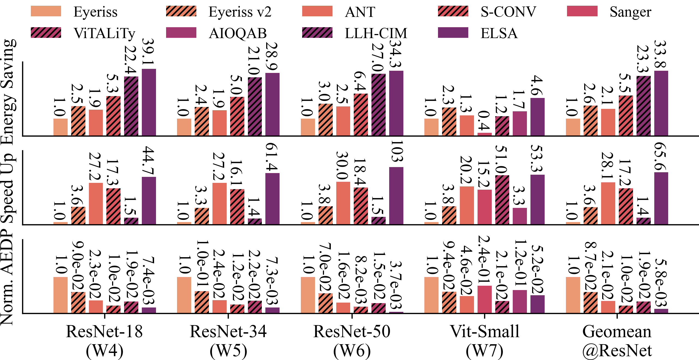
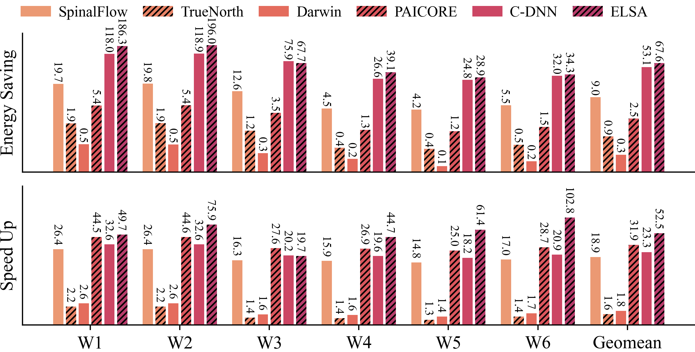

# ELSA Simulator

## Introduction

This project provides an end-to-end, cycle-level simulator for ELSA.
The simulator supports two execution modes:

## Slow Path

### 1. Obtain the Quantized Model Checkpoint

Download the checkpoint from the following Zenodo record:

https://zenodo.org/records/19442853

After downloading, place the model files in the directory specified in:

`~\ELSA_Simulator\convolution\configs\elsa_models.yaml`

You may also modify this path yourself if needed.

### 2. Reproduce Figure 16

Run the following command:

```bash
python3 run_figure16.py
```
### 3. Reproduce Figure 17

Run the following command:

```bash
python3 run_figure17.py
```


## Fast Path

We provide pre-generated tracer files in:

`/home/kang_you/ELSA_Simulator/tracer_files`


Users can use these tracer files to directly reproduce the results of Figure 16 and Figure 17 without running full simulations.

### 1. Reproduce Figure 16

```bash
python3 run_figure16.py --cache-dir tracer_files --skip-sim
```

### 2. Reproduce Figure 17

```bash
python3 run_figure17.py --cache-dir tracer_files --skip-sim
```

## Figure 16



## Figure 17


